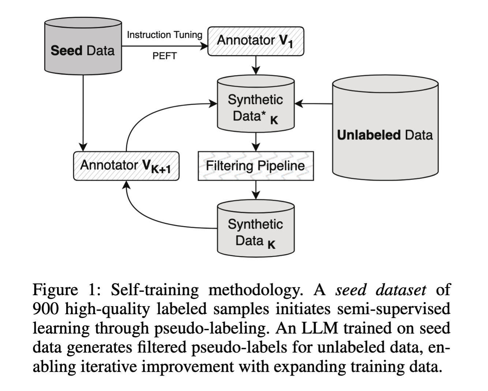
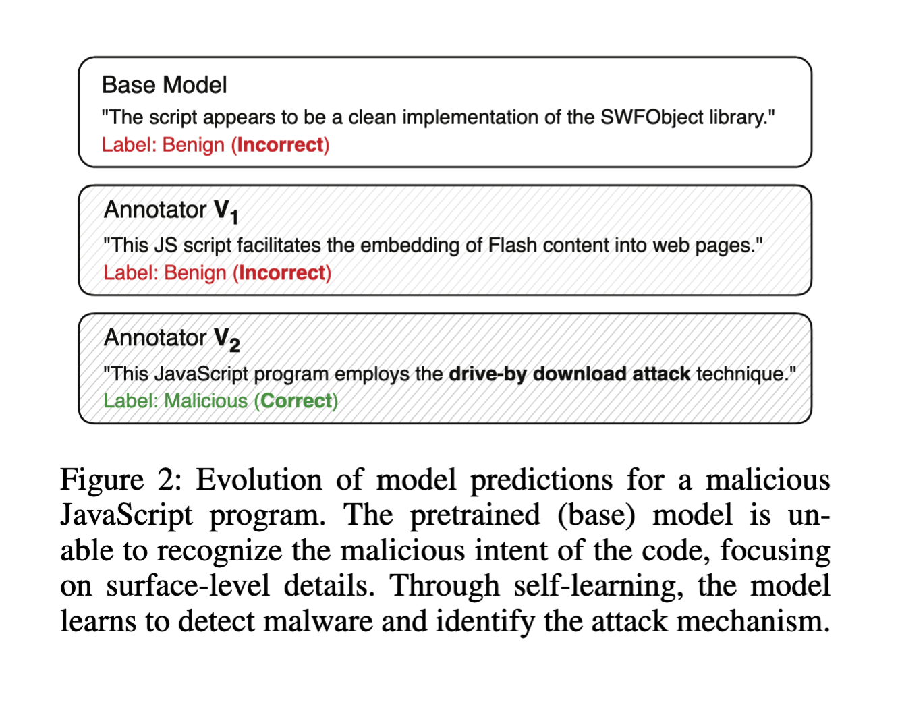

<picture>
  <source media="(prefers-color-scheme: light)" srcset="docs/assets/cs-logo.png">
  <source media="(prefers-color-scheme: dark)" srcset="docs/assets/cs-logo-red.png">
  
</picture>

# AutoMalDesc: Large-Scale Script Analysis for Cyber Threat Research

This repository contains research code for the *"AutoMalDesc: Large-Scale Script
Analysis for Cyber Threat Research"* article. It can aid in reproducing our
experiments.

<p>
  
  
</p>

## Setup

We recommend you create a virtual environment and install the library inside:

```bash
uv venv --python 3.12
source .venv/bin/activate
uv pip install -e .
uv pip install 'flash-attn==2.7.4.post1' --no-build-isolation
```

## Hierarchy

Code for training, running inference, and evaluating responses is in
`src/automaldesc`.

To see examples of running this code, especially in a Slurm environment, inspect
`scripts/`.

Scripts are configurable, and you can find sample configuration files in
`configs/`.

Important prompts are in the `prompts/` directory.

## Examples

To run inference with an LLM, you can call:

```bash
python3 -m automaldesc.inference \
    --model 'meta-llama/Llama-3.3-70B-Instruct' \
    --inputs test-metadata.jsonl \
    --prompt ./prompts/training.jinja \
    --chat_template True \
    --out_frame llm-outputs.jsonl \
    --joblog joblog.jsonl

# Or simply:
python3 -m automaldesc.inference --config_path ./configs/inference.yaml
```

To evaluate model responses, you can call:

```bash
python3 -m automaldesc.evaluate \
    --predictions llm-outputs.jsonl \
    --references test-metadata.parquet
```

To train a model with LoRA, we recommend using Slurm:

```bash
sbatch --nodes=2 ./scripts/train.slurm
```

## Data

The data used in the article is available [on Zenodo](https://zenodo.org/records/18243456).

## Developing

If you want to contribute to the repo in some way, we recommend installing the
pre-commit hooks first:

```bash
pre-commit install
```

## Citation

You can cite the accompanying article as follows:

```bibtex
@misc{apostu2025automaldesclargescalescriptanalysis,
      title={AutoMalDesc: Large-Scale Script Analysis for Cyber Threat Research},
      author={Alexandru-Mihai Apostu and Andrei Preda and Alexandra Daniela Damir and Diana Bolocan and Radu Tudor Ionescu and Ioana Croitoru and Mihaela Găman},
      year={2025},
      eprint={2511.13333},
      archivePrefix={arXiv},
      primaryClass={cs.CR},
      url={https://arxiv.org/abs/2511.13333},
}
```

## Support statement

AutoMalDesc is an open source project, not a CrowdStrike product. As such, it
carries no formal support, expressed or implied.
